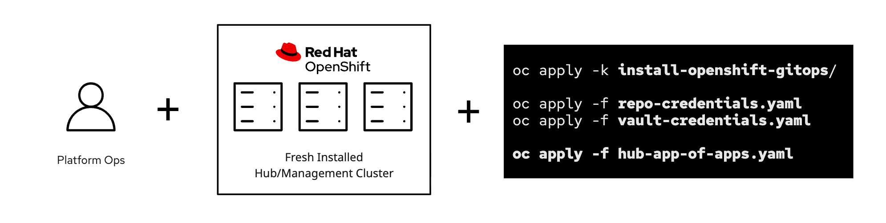
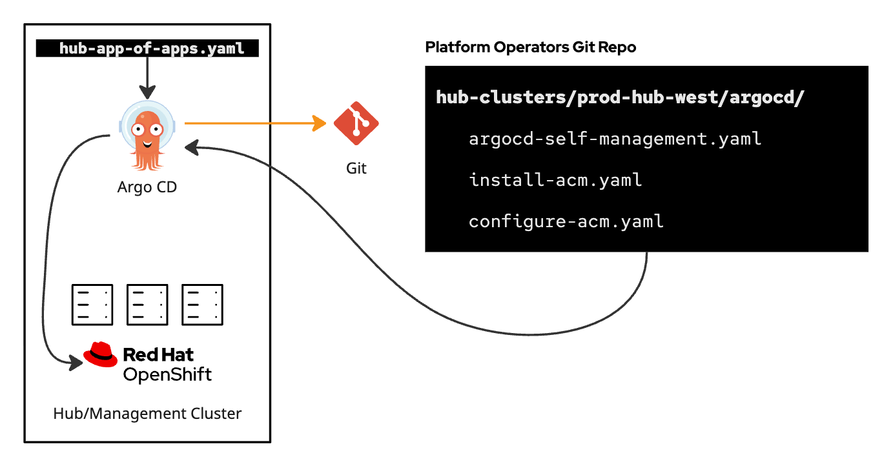
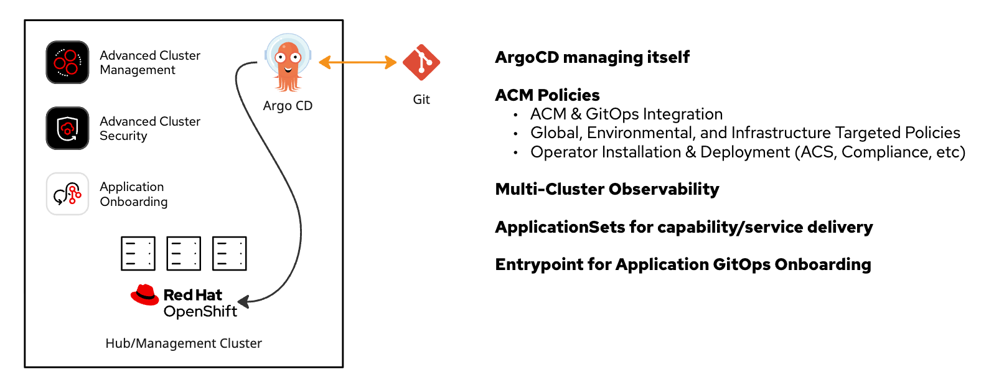
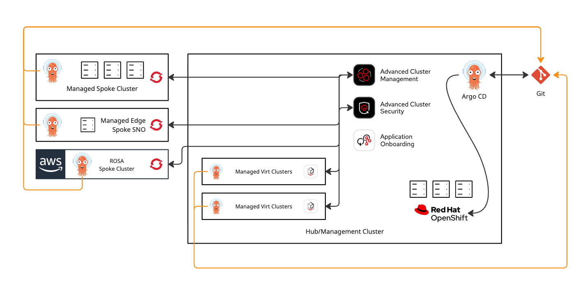

# Lab OpenShift

This is a repo for how I set up my OpenShift clusters in my homelab.

The goal is to provide an easy and GitOps-driven way to bootstrap things.

A base script installs GitOps, configures it with an AppOfApps pattern, including self-configuration.  Then it deploys ACM and a whole lot of ACM configuration.

## Prerequisites

- Vault - Some things like IDP Secrets need to easily be added where needed.  Sealed Secrets is lame.
- An OpenShift cluster or few.
- ODF on the clusters - if not, you just need to change some `storageClassName` definitions and do something different for MCO and Loki object storage.

## Architecture and Pattern

> Loosely based on this Validated Pattern but with things that make more sense https://validatedpatterns.io/patterns/multicloud-gitops/

### Bootstrap Initialization

The goal for bootstrapping is it should be as simple as possible, a 1-2-3 sort of thing.



This is done via the `./bootstrap/hub/deploy.sh` script against the OpenShift cluster that will become the Hub cluster.  It simply does:

- Creation of prerequisite secrets (Vault, Git, etc)
- Installation of ArgoCD
- Configuration of root ArgoCD App-of-Apps

### Bootstrap Process

Once that bootstrap script is started, the [root App-of-Apps](bootstrap/hub/bootstrap-application.yaml) will sync an [Application that reconfigures ArgoCD](bootstrap/hub/argo/hub-argocd.yaml) with best practices, and [another set of Applications](https://github.com/kenmoini/lab-ocp/blob/main/bootstrap/hub/argo/kustomization.yaml) that install ACM and configure it, syncing down all the assets like Policies, Placements, etc.



### Bootstrap Results

After ArgoCD syncs down everything, ACM is configured with everything it needs to manage OpenShift clusters at scale.  Some things are automatically configured to all OpenShift clusters, some to specific version, specific environments, with many additional labels available for capability enhancements - eg label a cluster to enable virtualization, developer services, enhanced observability, and more.

Some may leverage ArgoCD to sync everything down everywhere, but this does not scale well - we use ArgoCD for it's CD syncing capabilities, limit it's logic and sprawl, and use ACM for its strenghts.



### Multi-Cluster Management

With everything in place, you can then leverage the Hub for control your fleet no matter where they run or what they're running.



## Hub Cluster

I have a Hub cluster, 3 bare metal nodes that are pretty beefy.  I have it always deployed and use it as a Hub cluster for ACM and ACS.

## Included:

- **All OpenShift Clusters** `vendor=OpenShift`
  - [Policy] Health Checks
  - [Policy] Root CA Certificates
  - [Policy] Identity Providers
  - [Policy] Monitoring Configuration (Persistence + ACM)
  - [Policy] MachineConfig{uration}s
  - [Policy] KubeletConfig
  - [Policy] Node Labeler
  - [Policy] Console Samples Configuration
  - [Policy] Cluster Info Header with dynamic colors from a ConfigMap
  - [Policy] Removal of Kubeadmin
  - [Policy] Disabling of Self-Provisioner
  - [Policy] Enabling MultiNetworkPolicies
  - [Policy] Audit Log Configuration
  - [Policy] Etcd Encryption
  - [Policy] Image Vulnerability Scanning
  - [Policy] OpenShift GitOps (Base Operator Install)
  - [Policy] OpenShift Logging (Base Operator Install)
  - [Policy] ACS Operator
  - [Policy] Cluster Observability Operator
  - [Policy] Compliance Operator
  - [Policy] MetalLB Operator & Instance
  - [Policy] Node Maintenance Operator
  - [Policy] NMState Operator & Instance
  - [Policy] OADP Operator
  - [Policy] Secrets Store CSI Driver Operator
  - [Policy] Web Terminal Operator

- **Hub Cluster** `local-cluster=true`
  - [Policy] Hub Health Checks
  - [Policy] HCP ACM Infrastructure Credentials Integration
  - [Policy] Deploy ACS Central
  - [Policy] Deploy AAP 2.6

- **OpenShift 4.19 Clusters** `openshiftVersion-major-minor=4.19`
  - [Policy] OpenShift GitOps 1.18 Operator & Instance
  - [Policy] OpenShift Logging 6.3 Operator, Instance, and UI Plugin (when used with Loki)
  - [Policy] OpenShift Loki 6.3 Operator & Instance (with `rhLoki=true` cluster label)

- **Cluster Label Flagged**
  - `cluster-gitops-config=enabled` Deploys a per-cluster GitOps ApplicationSet of Applications.  Points to `clusters/{{name}}/gitops-config/`
  - `acs-secured-cluster=enabled` Deploys the ACS SecuredCluster CR integrated to the Hub ACS
  - `acs-central=enabled` Deploys the ACS Central CR to any cluster, by default an ACS Hub will be deployed on the ACM Hub
  - `nvidia-gpu=enabled` Deploys the NFD and NVIDIA GPU Operators and Instances
  - `virtualization=enabled` Deploys the Virtualization related Operators and Instances
  - `community-eso=enabled` Deploys the community External Secrets Operator with a ClusterSecretStore connecting to Vault.  Required for bootstrapping IDP and whatnot.
  - `appset/kyverno=enabled` AppSet that deploys Kyverno via Helm and Policies.
  - `appset/helm-vault=enabled` AppSet that deploys Hashicorp Vault via Helm.  Not really used since bootstrap needs managed Secrets but can be helpful for providing Vault as a service on managed clusters.
  - `appset/democratic-csi=enabled` AppSet that deploys Democratic CSI.
  - `appset/egress-ips=enabled` AppSet that deploys EgressIPs
  - `appset/vlan-stacks=enabled` AppSet that creates NNCP interfaces and NetworkAttachmentDefinitions for them from a simple list.
  - `developer-services=enabled` Deploys Developer Services (OpenShift Builds, DevSpaces, Pipelines, RHDP, etc)

- **Kyverno Policies**
  - Add Root CA Certificates to Pods
  - Add Proxy (and optionally Root CA Certificates) to Pods
  - Reload Pods with Changed ConfigMaps/Secrets

- **Per-Cluster GitOps**
  - Hub Cluster
    - Networking Configuration (NNCPs, NADs, MetalLB)
    - Virtualization Hydration (Templates, Migration Providers)

---

## Kemo Notes

- Deploy Hub Cluster
- Install LSO+ODF
- Create Vault Userpass secret
- Run bootstrap script
- Label hub-cluster in ACM with:

```bash
until $(oc get managedclusters.cluster.open-cluster-management.io/hub-cluster &>/dev/null); do echo "Waiting for ACM and Hub Cluster init..." && sleep 5; done

oc label managedclusters.cluster.open-cluster-management.io/hub-cluster community-eso=enabled
oc label managedclusters.cluster.open-cluster-management.io/hub-cluster cluster-gitops-config=enabled
oc label managedclusters.cluster.open-cluster-management.io/hub-cluster appset/kyverno=enabled
oc label managedclusters.cluster.open-cluster-management.io/hub-cluster appset/vlan-stacks=enabled
oc label managedclusters.cluster.open-cluster-management.io/hub-cluster appset/egress-ips=enabled
oc label managedclusters.cluster.open-cluster-management.io/hub-cluster rhLoki=enabled
oc label managedclusters.cluster.open-cluster-management.io/hub-cluster nvidia-gpu=enabled
oc label managedclusters.cluster.open-cluster-management.io/hub-cluster virtualization=enabled
```

---

## Todo

- Add ExternalDNS with PowerDNS and Route53
- Add cert-manager with sub-ca, StepCA ACME, and Let's Encrypt with R53
