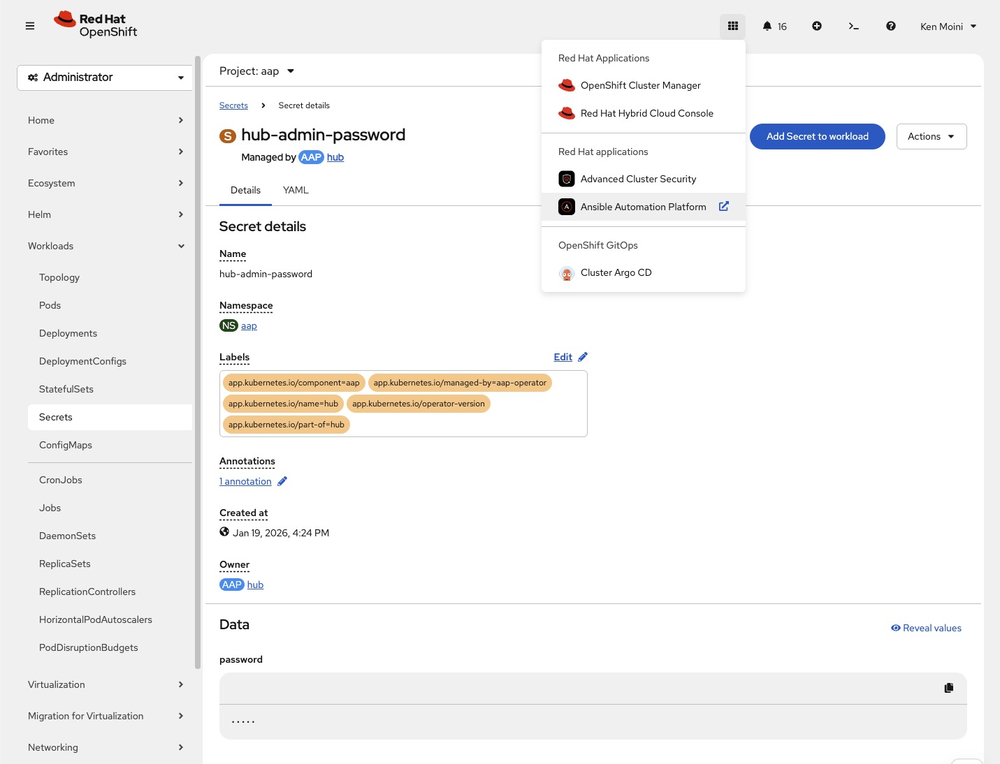

# Ansible Automation Platform Things

This folder houses objects to set up AAP in the context of it's use for OpenShift and related tasks around it's infrastructure and operations.

## Getting Started

Assuming you have the Hub cluster set up and it already has AAP installed as a function of it's Hub Cluster Policies, you'll have a vanilla AAP instance with the Automation Controller, Hub, and EDA deployed.

1. Log into the OpenShift cluster, navigate to the `aap` Namespace and get the default admin password out of the `hub-admin-password` Secret.
2. Access the AAP Web UI via the OpenShift Console Link in the upper right corner



From there add your Subscription and accept the license terms to unseal the platform.

With the platform subscribed, you can move forward with setting it up for use.  This can be daunting so this repo uses the AAP Configuration as Code constructs to hydrate the platform with everything needed for use with OpenShift and other things such as:

- [Controller] Create a HCP Virt Cluster via ZTP workflows
- [Controller] OpenShift Appliance Mode builder
- [Controller] Kemo "KubeBurner" load testing
- [EDA] Auto Expand PVCs at usage thresholds
- [EDA] Create PowerDNS records from HCP Virtualization Service creation event

Along with all the EEs/DEs, Projects, Inventories, Credentials needed to support those Templates and Rulebook Activations.

## Hydrating the Platform

To set up the AAP Controller and EDA with all the things needed for quick use, you can follow the steps below:

```bash
# Create a venv
python3 -m venv venv

# Activate the venv
source venv/bin/activate

# Install the needed Python packages
python3 -m pip install -r requirements.txt

# Log in to OpenShift
oc login ...

# Create a variable file for credentials
cat > aap-hub.vars.yaml <<EOF
aap_hostname: hub-aap.apps.tri-force.lab.kemo.network
aap_username: admin
aap_password: passwordFromOpenShiftSecret

# If using the PowerDNS integrations
pdns_admin_url: "https://pdns.kemo.labs"
pdns_admin_api_key: "securePass"
pdns_admin_username: "notansible"
pdns_admin_password: "n0tPassword"
EOF

# Ideally, vault the variable file
ansible-vault encrypt aap-hub.vars.yaml

# Run the Controller Setup Playbook
ansible-playbook -i inventory --ask-vault-pass -e "@aap-hub.vars.yaml" platform-configuration/configure-controller.yaml

# Run the EDA Setup Playbook
ansible-playbook -i inventory --ask-vault-pass -e "@aap-hub.vars.yaml" platform-configuration/configure-eda.yaml
```

After running that you should be able to log into the AAP dashboard and see it populated with everything needed for operation.

## Additional Credentials/RBAC

If you're using this for ZTP or PVC expansion workflows you'll also need a few extra credentials created in OpenShift for AAP to use.

These manifests can be found in the `ocp-glue` folder:

- [eda-auto-expand-pvc.yaml](./ocp-glue/eda-auto-expand-pvc.yaml) is some RBAC for AAP to mutate PVCs
- [git-pull-credentials.yaml](./ocp-glue/git-pull-credentials.yaml) is needed for pulling from a Git repo for ZTP/GitOps workflows
- [git-push-credentials.yaml](./ocp-glue/git-push-credentials.yaml) is needed for pushing the created YAML manifests to a Git repo for ZTP/GitOps.  There's an example of an ExternalSecret version of this in [git-push-externalsecret.yaml](./ocp-glue/git-push-externalsecret.yaml)

## OpenShift EDA Setup

The EDA workflows provide auto expansion of PVCs and generation of DNS records in PowerDNS based on events emitted by the OpenShift cluster.

In order to wire in the event stream from OpenShift into EDA you need to configure Alertmanager to send the alerts to the EDA Rulebook Activations.


